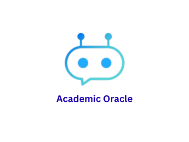

<div align="center">

   

  <p><strong>Clarity for Every Concept. Where Knowledge Becomes Insight.</strong></p>

  <p>
    <a href="#features">Features</a> •
    <a href="#tech-stack">Tech Stack</a> •
    <a href="#support">Support</a>
  </p>

  <p>
    
    
    
    
  </p>

  <p>
    
    
    
    
    
  </p>

</div>

# Academic Oracle

**Academic Oracle** is a learning-focused AI platform designed to maximize understanding, not passive consumption.

Instead of immediately giving answers, Academic Oracle follows a scientifically grounded flow:

> **Ask → Think → Hint → Attempt → Feedback → Pattern → Insight → Mastery**

The goal is not memorization — it’s *deep, durable learning*.

---

## Why Academic Oracle?

Most AI tools optimize for speed.  
Academic Oracle optimizes for **retention, intuition, and reasoning**.

### Core Learning Principles
- Active recall before answers
- Progressive hinting instead of instant solutions
- Error-correction loops
- Pattern discovery over rote explanation
- Minimal UI disruption to maintain cognitive flow

You don’t just learn faster — you learn *properly*.

---

## Features

### 🧠 Learning Engine

- Hint-based reasoning flow (Ask first, reveal progressively)
- Structured thinking prompts
- Pattern extraction instead of answer dumping

### 📝 Integrated Quiz Platform (NEW)

- Auto-generated concept-specific quizzes
- Multi-question adaptive testing
- Mastery popups & performance feedback
- Reinforcement-based correction
- Mid-session language switching
- Unified Chat + Quiz UI system

### 🎨 UX & Rendering

- Robust Markdown rendering
- Math (KaTeX)
- Tables
- Code blocks
- Dark / Light mode
- Responsive design (desktop & mobile)
- Fail-in-console architecture (UI never crashes)

### 🔐 Security & Architecture

- AES-GCM-256 encryption for sensitive keys
- Supabase-backed session continuity
- Arcade-style interactive onboarding demo

---

## Tech Stack

- **Frontend:** React 19 + TypeScript
- **Backend (AI):** Google GenAI models (Gemini-3, Gemini-2.5)
- **Backend (Auth):** Supabase & Google OAuth
- **Build Tool:** Vite 6
- **Styling:** Tailwind CSS
- **Math Rendering:** KaTeX
- **State & UX:** Custom lightweight logic (no heavy frameworks)
- **Security:** AES-GCM-256 encryption for sensitive keys
- **AI Provider:** Gemini API (user-supplied key)

---

## Running Locally

### Prerequisites
- **Node.js** (v18+ recommended)

### Setup

1. Install dependencies:
   ```bash
   npm install

2. Setup Environment Variables:
   ```env.local
   VITE_SUPABASE_URL=YOUR_SUPABASE_URL
   VITE_SUPABASE_ANON_KEY=YOUR_SUPABASE_ANON_KEY

3. Start development server:
   ```bash
   npm run dev

*API Key will be asked during initial signup for an account*

---

## Project Vision

Academic Oracle aims to *redefine how AI integrates into education*:
- Not as a solver.
- Not as a shortcut.
**But as a structured reasoning partner.**

The long-term goal is to build *a universal academic cognition system* that scales from secondary education to research-level inquiry.

---

## Credits

**Academic Oracle** was designed and built by **Vo Tan Binh**.

This project represents original work in:
- Learning-science–driven AI interaction design
- Progressive reasoning and hint-based pedagogy
- Closed-feedback AI tutoring systems
- Secure, minimal, and distraction-free educational UX

If you build upon this work, attribution is appreciated.

## Support

If Academic Oracle helps your learning:

* ⭐ Star the repository

* ☕ Support via [Buy Me a Coffee](https://buymeacoffee.com/votanbinh)

* 🧠 Use it, break it, and learn from it

Recognition matters.
Impact matters more.
