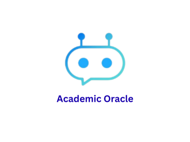

<div align="center">

   

  <p><strong>Clarity for Every Concept. <br />Where Knowledge Becomes Insight.</strong></p>

  <p>
    <a href="#features">Features</a> •
    <a href="#tech-stack">Tech Stack</a> •
    <a href="#licensing-and-project-identity">Licensing</a> •
    <a href="#support">Support</a>
  </p>

  <p>
    <a href="#licensing-and-project-identity">
      
    </a>
    <a href="#licensing-and-project-identity">
      
    </a>
    
    
    
    
  </p>

  <p>
    
    
    
    
    
  </p>

</div>

# Universal Academic Oracle

**Academic Oracle** is a learning-focused AI platform designed to maximize understanding, not passive consumption — now extended into a **full exam practice and evaluation system**.


> [!IMPORTANT]
> Academic Oracle is not a traditional chatbot.  
> It is a **structured learning and evaluation system** designed to guide reasoning, not just provide answers.


Academic Oracle operates across two tightly integrated modes:
- **Learning Mode** — builds deep understanding through guided reasoning
- **Exam Mode** — trains performance under real exam conditions with structured evaluation

Instead of immediately giving answers, Academic Oracle follows a scientifically grounded flow:


> [!IMPORTANT]
> **Learn Mode:** Ask → Think → Hint → Attempt → Feedback → Pattern → Insight → Mastery  
> **Exam Mode:** Attempt → Submit → Evaluate → Analyze → Target → Improve


The goal is not memorization — it’s *deep, durable learning with real exam performance*.

---

## Why Academic Oracle?

Most AI tools optimize for speed.  
Academic Oracle optimizes for **retention, intuition, and reasoning**.

### Core Learning Principles
- Active recall before answers
- Progressive hinting instead of instant solutions
- Error-correction loops
- Pattern discovery over rote explanation
- Minimal UI disruption to maintain cognitive flow


> [!TIP]
> You don’t just learn faster — you learn *properly*.


---

## Features

### 🧠 Learning Engine *(updated v2.4.9)*

- **Hint-based reasoning flow** — ask first, reveal progressively
- **Structured thinking prompts** with richer Oracle Memory JSON returns
- **Feynman-technique reinforcement** when understanding needs rebuilding from first principles
- **Exam-style adaptation** and wider mastery branching for context-aware coaching
- **Pattern extraction** instead of answer dumping
- **Follow-up suggestion system** *(updated v2.4.9)*
  - Context-aware follow-up buttons on text selection
  - New "Follow up" mode with input container (no auto-send)
  - Selection actions now render linked UI containers instead of raw selected-question text
  - Follow-up chips can highlight and jump back to the selected section
  - Reduces friction between curiosity → action
- **Improved mastery check system**
  - Max 2 mastery checks per topic
  - Adaptive phrasing after incorrect attempts
  - Smart fallback: explain → user chooses retry or move on
- **Oracle Memory system**
  - Tracks understanding, mistakes, and learning progress across sessions
  - Enables continuity between Learning Mode and Exam Mode
- **Cross-mode learning loop**
  - Concepts learned in chat influence exam performance
  - Exam results feed back into targeted learning and revision

---

### 📝 Integrated Quiz Platform *(updated v2.4.9)*

- Auto-generated concept-specific quizzes
- Multi-question adaptive testing
- Mastery popups & performance feedback
- Reinforcement-based correction
- Mid-session language switching
- Unified Chat + Quiz UI system
- **Wrong-answer follow-up chips** *(new v2.4.9)*
  - Quiz-to-chat follow-ups now render clean UI chips instead of raw text injection
  - Backend quiz and chat flows remain unchanged for compatibility
- **Topic-aware quiz configuration** *(new v2.4.8)*
  - Choose from tracked Oracle Memory topics with usable data only
  - Defaults to the current topic, while preserving manual topic selection across tab switches
  - Mastery popup can now jump directly into Quiz with the relevant topic preselected
- **Safer quiz start flow** *(new v2.4.8)*
  - Start button stays disabled until a valid topic is selected
  - Config refresh now shows a locked loading state to prevent stale quiz launches
- **Per-topic config persistence** *(new v2.4.8)*
  - Quiz settings cache independently per topic in `sessionStorage`
  - Cached configs refresh only when learning memory or chat context changes for the active topic
- Short-query routing can jump directly into Balanced race mode
- **Gemini-first execution** *(updated v2.4.0)*
  - Faster and more consistent quiz generation
  - Improved reliability with validated fallback system

---

### 📊 Learning Dashboard *(updated v2.4.8)*

- Dedicated dashboard tab for learner overview and progress reflection
- Displays user profile, academic level, current topic, and learning level
- Circular learning-efficiency indicator based on tracked performance
- Expandable topic panels with key notes, formulas/cues, quiz attempts, and recommended next focus
- Surfaces strengths, weaknesses, and overall session summary in one place
- Integrated **Download Session Summary** action from the dashboard
- **Cleaner topic management** *(new v2.4.8)*
  - Empty or hallucinated topic shells are skipped in dashboard rendering
  - Each topic toggle now supports direct deletion with confirmation
- **Focused summary previews** *(new v2.4.8)*
  - Strengths, weaknesses, and overall summary sections show the first 5 items by default
  - Independent see more / see less controls expand each section without affecting the others

---

### 🎓 Exam Practice Module *(updated v2.5.2)*

**Transforms Academic Oracle from a learning assistant into a full exam + evaluation system.**


> [!NOTE]
> Exam Mode is not just for practice — it is designed to **train real exam performance under real conditions**,  
> including time pressure, limited help, and structured evaluation.


### 🧪 Real Exam Simulation

- **Full Exam Mode** — timed conditions, restricted help, and no live feedback  
- Replicates real testing pressure to train focus, discipline, and decision-making  
- **Performance Memory Injection** *(new v2.5.2)* — Detailed exam summaries (including question prompts, user answers, and corrections) are now injected into the AI's memory.
- **Total Capture Safeguards** *(new v2.5.2)* — Upgraded prompt engineering with a *General Knowledge Override Exception* and *Mandatory Execution Checklist* to ensure 100% of reading passages and sub-questions are captured verbatim from source documents, even if they appear answerable by general knowledge.
- Designed for structured exam systems *(IGCSE, A-Level, AP, SAT-style preparation)*  


### 📄 Multi-Format Exam Input

- Process full exams from **PDF**
- **Enhanced passage extraction** *(new v2.5.0)* — identifies and isolates reading passages or shared information blocks
- **Grouped Parts Support** *(new v2.5.0)* — automatically detects and renders exam sections (e.g., Part 3: Reading) with dedicated headers
- Automated **question extraction + mark scheme parsing**


### 🎚️ Tiered Help System

Control how much assistance is allowed during exam sessions:

- **Level 0:** Strict exam conditions *(no hints, no guidance)*  
- **Level 1:** Light conceptual nudges  
- **Level 2:** Guided scaffolding  
- **Level 3:** Full worked solutions  

Enables a smooth transition from **independent performance → supported improvement**.


### 🧠 Examiner-Style AI Grading

- **Mark scheme–aligned evaluation** (not simple answer matching)
- Step-based marking logic where applicable
- **Instant scoring with detailed breakdowns**
- **Estimated grade boundaries** based on performance
- Core Test prompt orchestration now runs through Supabase Edge Functions for tighter backend control while remaining compatible with older production flows

> Not just “correct or incorrect” — but *how well you would score in a real exam*.


### 📊 Performance Analysis & examMemory

- Per-question mistake identification with targeted improvement suggestions  
- **examMemory system** tracks:
  - Weak topics  
  - Error patterns  
  - Performance trends across sessions  
- **Blind-Checklist feature** *(new v2.5.0)*:
  - Personalized pre-exam guide generated from all session metrics (chats, quizzes, tests, memory)
  - Designed for a quick review right before test day
  - Synthesized via smart/agentic model racing for maximum effectiveness

- Builds a **persistent exam-performance model** over time


### 🔁 Review → Targeted Revision Loop

- Results automatically sync with **Oracle Memory**
- Generates **focused revision checklists** based on actual mistakes
- Converts exam performance directly into structured learning paths

> Every exam becomes data for the next improvement cycle.


### 📤 Full Analytics Export

- Download comprehensive **DOCX reports** including:
  - Scores and breakdowns  
  - Model answers  
  - Improvement insights  

Ideal for:
- Self-review  
- Teacher feedback  
- Progress tracking over time  


### ⚡ Why This Matters

**Before:**
- Practice questions in isolation  
- No real timing pressure  
- Limited or generic feedback  
- No long-term tracking  

**With Academic Oracle Exam Mode:**
- Full exam simulation  
- Examiner-style grading  
- Weakness tracking across sessions  
- Automatic conversion of mistakes → revision strategy  


> [!TIP]
> **Don’t just practice exams — *train* how you perform in them.**


---

### ⚙️ Intelligent Request Routing *(major update v2.4.0, refined v2.5.0)*

- **Gemini-first orchestration pipeline** — Chat / Quiz / Summary / Crons all prioritize Gemini models
- **Failure Tracking & Real-time Recovery** *(new v2.5.0)*
  - Monitors unretriable errors, rate limits (429/503), and format mismatches per model
  - Automatically skips failing models in real-time, falling back to other providers or OpenRouter
  - **Automatic Race Mode** triggers when multiple primary models experience unusual failure rates
- OpenRouter used strictly as last-resort fallback with validation
- **Multi-mode execution pipeline**
  - Standard
  - Fast
  - Balanced
  - Agentic
  - Web Search
- **Upgraded racing logic** — from "first response wins" → "first *valid* response wins"
- **Dynamic routing** based on query complexity, latency conditions, and system load
- **Non-blocking web search fallback** *(new v2.4.9)*
  - Failed web search no longer blocks the full chat request
  - Backend receives a fallback flag so responses stay cautious when live data is unavailable
- **Real-time system state visibility** via Loading Status Text Bar
  - Displays current processing stage
  - Improves transparency of AI behavior

> Academic Oracle doesn't just respond — it decides how to think first.

---

### 🌐 Web Search Integration *(updated v2.4.9)*

- **Tavily** as primary search provider; **JigsawStack** as fallback
- Designed for real-time knowledge retrieval and SPA / dynamic site parsing
- Activated only when needed (cost-efficient routing)
- **Graceful search failure path** *(new v2.4.9)* — failed retrieval continues the chat request with an explicit uncertainty flag for backend prompt injection
- **Quota accuracy** *(new v2.4.9)* — web search quota is counted only after search results are successfully retrieved
- **Improved hallucination safety** — if search quota is exceeded, system returns a controlled response (no model call), preventing outdated answers being framed as current
- **Hybrid reasoning** — AI + live data synthesis

---

### 🔐 Security & Architecture *(major update v2.3.0, reinforced v2.4.9)*


> [!IMPORTANT]
> **All AI interactions are processed through a secured backend.**  
> **No API keys or sensitive logic are exposed to the client.**


- All AI API calls handled via Supabase backend — no direct client exposure of keys
- Production-grade, secure Edge Function orchestration
- Core prompt logic centralized in backend
- **Expanded backend control** *(v2.4.8)*
  - Core Test exam prompts were moved further into Supabase Edge Functions
  - Oracle Memory topic creation constraints were tightened to avoid unsupported topic creation
- Encrypted handling of sensitive internal data
- Supabase-backed session continuity
- **Reliability enhancements** *(v2.4.0)*
  - Strict fallback validation before returning responses
  - Reduced silent failures in multi-model execution

#### 🛡️ Prompt Security Layer

- Jailbreak detection & filtering system
- Prompt sanitation before model execution
- **Prompt guard flow** *(updated v2.4.9)*
  - Heuristics now stop only clear jailbreak attempts
  - Model guard handles inappropriate content, sophisticated jailbreaks, and web-search decisions
  - Jailbreak-risk prompts always disable web search before any normal routing continues
- Updated prompt constraints to reduce answering beyond knowledge cutoff
- Controlled response shaping to prevent misuse

> Academic Oracle is no longer just a frontend AI tool — it is a secured, distributed AI system.

---

### 🎨 UX & Rendering

- **Robust Markdown rendering** — math (KaTeX), tables, code blocks
- Dark / Light mode
- Responsive design (desktop & mobile)
- Structured session summary generation backed by Oracle Memory data
- **UI improvements** *(v2.4.0)*
  - File uploads now stack above input (fixes mobile layout issues)
  - Follow-up container UI with dynamic spacing (no overlap bugs)
- **UI improvements** *(v2.4.8)*
  - Added a direct `Log out` action in the Profile page
  - Logout now clears persisted Quiz and Core Test runtime session state
- **UI improvements** *(v2.4.9)*
  - Follow-up, explain-further, and quiz wrong-answer actions now render chips instead of raw injected text
  - Selection chips can highlight the referenced source section on click
- **Non-blocking UI architecture** — failures never crash the interface; graceful degradation on errors

---

## Running Locally

### Prerequisites
- **Node.js** (v18+ recommended)


### Setup

1. Install dependencies:
```bash
npm install
```
2. Setup your Supabase project
* Create database
* Configure auth
* Deploy Edge Functions

3. Configure public environment variables:
```bash
VITE_SUPABASE_URL=YOUR_SUPABASE_URL
VITE_SUPABASE_ANON_KEY=YOUR_SUPABASE_ANON_KEY
VITE_JIGSAWSTACK_KEY=YOUR_JIGSAWSTACK_API_KEY
```

4. Start development server:
```bash
npm run dev
```


> [!WARNING]
> This public repository **intentionally excludes** certain backend infrastructure, deployment 
> configuration, and protected service implementation details.
> 
> As a result, some advanced **production features may not be fully reproducible**
> from the public repository alone.


---

## Tech Stack

- **Frontend:** React 19 + TypeScript
- **Backend (AI Orchestration):** Supabase Edge Functions
- **Models:**
  - Google GenAI (Gemini 2.5, Gemini 3)
  - OpenRouter (last-resort fallback with validation layer)
- **Web Search:** Tavily (primary) + JigsawStack (fallback)
- **Auth & Database:** Supabase (Postgres + OAuth)
- **Build Tool:** Vite 6
- **Styling:** Tailwind CSS + Framer Motion
- **Math Rendering:** KaTeX
- **Document Handling:** docx, PDF.js, Mammoth, FileSaver
- **OCR:** Tesseract.js
- **Syntax Highlighting:** Highlight.js
- **Routing:** React Router v7

---

## Project Vision

Academic Oracle aims to *redefine how AI integrates into education*:
- Not as a solver.
- Not as a shortcut.

**But as a structured reasoning partner.**

The long-term goal is to build *a universal academic cognition system* that scales from secondary education to research-level inquiry.

---

## Official Repository

This is the **official upstream source repository** for **Universal Academic Oracle**.

**Canonical source:**  
https://github.com/Henrycoding-design/Academic-Oracle-AI-Chatbot-Model

**Live product:**  
https://academicoracle.onrender.com

---

## Licensing and Project Identity

This repository uses a **mixed-license structure**.

### Code License

> [!IMPORTANT]
> **Not all code in this repository is open for reuse.**  
> Certain core logic and system design components are **explicitly excluded** from the Apache-2.0 license.

Unless otherwise stated, the public code in this repository is licensed under the
**Apache License 2.0**.

However, selected files containing core product logic, orchestration behavior,
service intelligence, and project-defining implementation details are **excluded**
from Apache-2.0 and remain **All Rights Reserved**.

Public visibility of excluded files does **not** grant permission to copy,
redistribute, or reuse them outside the official upstream repository.

See:
- [`LICENSE`](./LICENSE)
- [`NOTICE`](./NOTICE)

### Branding and Identity
The project name, branding, visual identity, screenshots, release identity, and
related non-code brand elements are **not** granted under Apache-2.0 unless
explicitly stated otherwise.

Forks, mirrors, and derivative versions may not present themselves as the
official version of this project or imply endorsement by the original author.

See:
- [`TRADEMARK_POLICY.md`](./TRADEMARK_POLICY.md)

---

## Credits

**Universal Academic Oracle** was designed and built by **Vo Tan Binh (Henrycoding-design)**.

This project represents original work in:
- Learning-science–driven AI interaction design
- Progressive reasoning and hint-based pedagogy
- Closed-feedback AI tutoring systems
- Secure, minimal, and distraction-free educational UX

If you build on Apache-licensed portions of this project, please preserve
attribution and clearly reference the original source.

For protected files, branding, and excluded components, refer to the repository's
licensing and policy documents.

## Support

If Academic Oracle helps your learning:

* ⭐ Star the repository

* ☕ Support via [Buy Me a Coffee](https://buymeacoffee.com/votanbinh) or 
  [Kofi](https://ko-fi.com/tanbinhvo)
